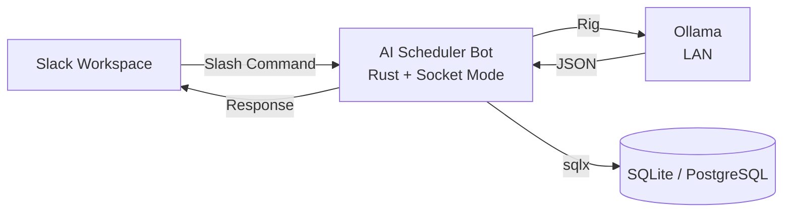

# AI Scheduler Bot

Slack から自然言語でスケジュールを登録できる Bot。`/schedule 明日15時から1時間、田中さんと打ち合わせ` のような入力を、ローカルLLM (Ollama) で構造化して DB に保存します。

## Features

- Slack の Slash Command で自然言語入力 → 構造化 JSON → DB 保存
- 「明日」「来週」などの相対日時を、ユーザーのタイムゾーンを考慮して解釈
- 解析中 / 解析完了 / スケジュール詳細の3段階で進捗を表示
- ボタンによる取消操作 (論理削除、UI も「取消済み」表示に書き換え)
- ローカル LLM 利用 (クラウド送信なし、プライバシー保護)

## Tech Stack

- **Language**: Rust
- **Web/Async**: tokio, axum
- **Slack**: slack-morphism (Socket Mode)
- **LLM**: Rig + Ollama
- **DB**: sqlx (SQLite / PostgreSQL 両対応、feature flag で切替)
- **Other**: chrono, tracing, thiserror, anyhow

## Architecture



## Setup

### 1. Slack App の作成

https://api.slack.com/apps で「Create New App」→「From an app manifest」を選び、以下の Manifest を貼り付け:

```yaml
display_information:
  name: AI Scheduler Bot
  description: Natural language scheduling for Slack
  background_color: "#2c3e50"

features:
  bot_user:
    display_name: AI Scheduler
    always_online: true
  slash_commands:
    - command: /schedule
      description: 自然言語で予定を登録
      usage_hint: 明日15時から1時間、田中さんと打ち合わせ
      should_escape: false

oauth_config:
  scopes:
    bot:
      - commands
      - chat:write
      - users:read

settings:
  interactivity:
    is_enabled: true
  socket_mode_enabled: true
  org_deploy_enabled: false
  token_rotation_enabled: false
```

### 2. トークン発行

#### App-Level Token (xapp-...)

1. Settings → Basic Information → App-Level Tokens → Generate Token
2. Scope: `connections:write` を追加
3. 発行されたトークンをコピー

#### Bot Token (xoxb-...)

1. Settings → Install App → Install to Workspace
2. インストール後、OAuth & Permissions → Bot User OAuth Token をコピー

### 3. Ollama の準備

LAN 上の任意のマシンで Ollama を起動 (自宅サーバー等):

```bash
ollama pull <model-name>
ollama serve
```

### 4. .env の設定

`.env.example` をコピーして `.env` を作成し、値を埋める:

```bash
cp .env.example .env
```

```bash
SLACK_APP_TOKEN=xapp-...
SLACK_BOT_TOKEN=xoxb-...

OLLAMA_BASE_URL=http://<your-ollama-host>:11434
OLLAMA_MODEL=<your-model>

DATABASE_URL=sqlite:./schedule.db?mode=rwc

RUST_LOG=info
```

### 5. ビルド・起動

```bash
cargo run
```

## Usage

### スケジュール登録

Slack の任意のチャンネル (Bot を招待済み) または Bot との DM で:

```
/schedule 明日15時から1時間、田中さんと打ち合わせ
/schedule 来週月曜10時から定例会議、会議室A
/schedule 5月30日 14:00 〜 16:00 Zoomで全体ミーティング https://zoom.us/j/123456
```

### スケジュール取消

スケジュール表示の `❌ 取消` ボタンを押下。元のメッセージが「取消済み」表示に書き換わります。

## Project Structure

```
src/
├── main.rs              # 起動と依存組み立て
├── config.rs            # 環境変数読み込み
├── error.rs             # ドメインエラー型
├── domain/              # ドメインモデル (Event, NewEvent, ParsedSchedule)
├── slack/               # Slack 受信 (Socket Mode) + ハンドラ
├── llm/                 # LlmProvider トレイト + Ollama 実装
├── store/               # EventStore トレイト + sqlx 実装
└── notification/        # NotificationChannel トレイト + Slack 実装

migrations/
├── sqlite/0001_init.sql
└── postgres/0001_init.sql
```

トレイトでレイヤーを抽象化しており、将来の差し替え (別 LLM プロバイダ、別 DB バックエンド等) を見据えた設計。

## Database Switching

デフォルトは SQLite。PostgreSQL に切り替える場合:

```bash
cargo run --no-default-features --features postgres
```

## Roadmap

- [x] `/schedule <自然言語>` で登録
- [x] 取消 (論理削除)
- [ ] `/schedule list <期間>` で一覧取得
- [ ] 自然言語で削除/変更
- [ ] リマインダー通知

## License

MIT
